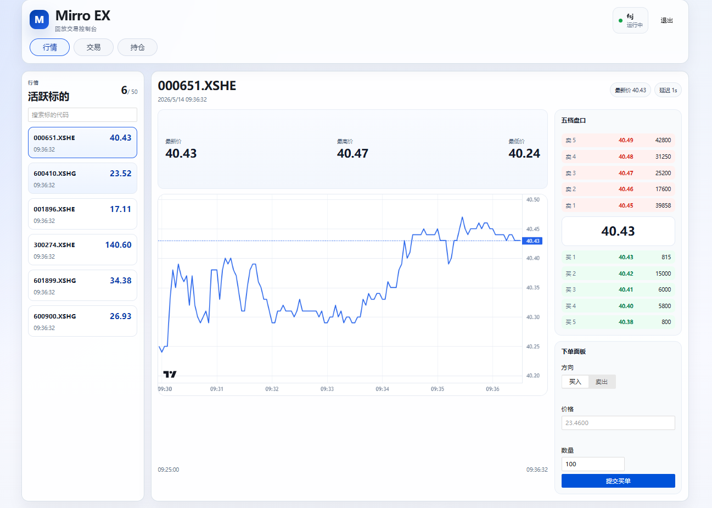
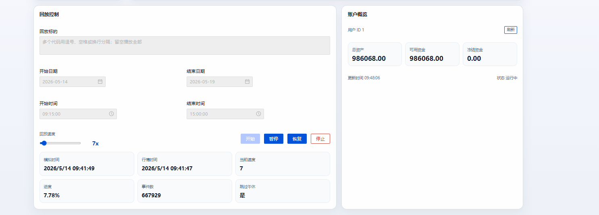
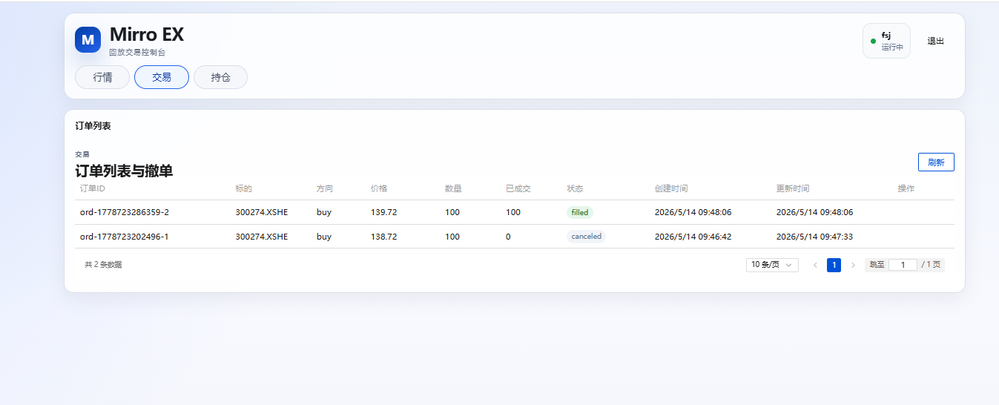

# Mirro-Ex

[](https://github.com/cooronx/mirro-ex/stargazers)
[](https://www.rust-lang.org/)
[](LICENSE)

Mirro-Ex 是一个面向沪深市场的 L2 行情回放与模拟交易系统。

支持订单簿重建，模拟用户撮合，为行情回放，拆单，t0等研究工作提供了一个模拟交易所（而不是纯k线模拟）的回测平台







## 功能特性

- 从 ClickHouse 读取沪深逐笔委托与成交数据。
- 按交易日、时间区间、证券代码列表和倍速控制行情回放。
- 支持回放启动、暂停、恢复、停止和状态查询。
- 使用多 worker 重建不同证券的订单簿。
- 将订单簿快照按交易日和证券代码导出为 Parquet。
- 提供 Web UI，用于回放控制、行情展示、账户、下单、撤单、订单和持仓查看。
- 使用 SQLite 维护模拟账户、订单、成交、持仓、资金冻结和持仓冻结。
- 预留 NATS 实时发布订单簿快照路径，目前主要是连接与编码骨架。

## 项目文档

- [撮合流程说明](docs/matching_flow.md)
- [核心数据结构说明](docs/struct.md)

## 系统架构

```text
ClickHouse L2 data
        |
        v
replay reader / coordinator / simulated clock
        |
        v
orderbook workers
        |
        +----> Parquet order book snapshots
        |
        +----> webdata::MarketState
        |          |
        |          +----> HTTP APIs / SSE
        |                    |
        |                    +----> Vue Web UI
        |
        +----> simulated limit order matching
                   |
                   +----> SQLite trading state
```

主要模块：

- `src/replay/`：行情读取、事件排序、模拟时钟和回放协调。
- `src/orderbook_worker.rs`：多 worker 订单簿重建、快照记录和模拟订单撮合入口。
- `src/matcher/`：订单簿与交易所撮合相关机制。
- `src/trading/`：模拟账户、订单、成交、持仓和结算逻辑。
- `src/web/`：Salvo HTTP 路由和 API handler。
- `src/webdata/`：服务 Web UI 的行情状态和 SSE 事件模型。
- `webui/`：Vue 3 前端。

## 快速开始

### 依赖

- Rust 1.85 或更高版本。
- Node.js 20 或更高版本，建议搭配 npm。
- ClickHouse，用于存放 L2 行情源数据。
- NATS Server，可选；当前不是主数据路径。
- Python 3.9 或更高版本。
- Hugging Face CLI，用于下载项目样例数据。

- Rust 侧 SQLite 使用 `rusqlite` 的 `bundled` feature，不需要系统安装sqlite也能跑。
- Protobuf 编译使用 `protoc-bin-vendored`，也不需要手动安装 `protoc`。

### 安装

克隆仓库：

```bash
git clone https://github.com/cooronx/mirro-ex.git
cd mirro-ex
```

安装前端依赖：

```bash
cd webui
npm install
cd ..
```

安装 Hugging Face CLI：

```bash
python -m pip install -U "huggingface_hub[cli]"
```

准备本地配置：

```bash
cp config/conf.toml.example config/conf.toml
```

然后按本机环境修改 `config/conf.toml`：

- `[db]`：ClickHouse 地址、账号、密码和数据库名。
- `[db.tables]`：逐笔委托、逐笔成交等表名。
- `[db.schema]`：ClickHouse schema、SQLite schema 和本地交易库路径。
- `[replay]`：worker 数、批大小、盘口深度和 snapshot parquet 输出目录。
- `[web]`：后端监听地址和端口，默认是 `127.0.0.1:5800`。

### 下载样例数据

Mirro-Ex 的可运行样例数据放在 Hugging Face 数据集 [cooronxon/AShareTickData](https://huggingface.co/datasets/cooronxon/AShareTickData/tree/main)。

下载到本地：

```bash
hf download cooronxon/AShareTickData \
  --repo-type dataset \
  --local-dir data/AShareTickData
```

数据集包含 2026-05-06 至 2026-05-29 之间的 18 个交易日，覆盖 6 个标的：

- `000651.XSHE`
- `001896.XSHE`
- `300274.XSHE`
- `600410.XSHG`
- `600900.XSHG`
- `601899.XSHG`

目录结构：

```text
data/AShareTickData/
├── TickData/
│   ├── SHOrder.parquet
│   ├── SZOrder.parquet
│   └── Transaction.parquet
└── L1_snapshot/
    └── <交易日>/<证券代码>.parquet
```

`TickData` 是回放使用的 L2 逐笔数据；`L1_snapshot` 是用于结果对比的五档行情快照。

### 初始化 ClickHouse 数据

ClickHouse 表结构脚本位于：

```shell
python scripts/create_local_clickhouse_tables.sql
```

模拟交易 SQLite 表结构脚本位于：

```shell
python scripts/create_trading_sqlite_schema.sql
```

后端启动时会根据配置初始化本地 SQLite 交易库。但是 ClickHouse 需要提前建表并导入 L2 样例数据。

## 运行

### 后端

```bash
cargo run
```

默认后端地址：

```text
http://127.0.0.1:5800
```

### 前端开发服务器

```bash
cd webui
npm run dev
```

默认前端地址：

```text
http://127.0.0.1:5173
```

### 前端构建

```bash
cd webui
npm run build
```

### 命令行控制回放

除了 Web UI，也可以使用辅助脚本调用后端回放接口：

```bash
python scripts/replay_controller.py start \
  --start-date 2026-05-14 \
  --end-date 2026-05-14 \
  --start-time 09:30:00.000 \
  --end-time 15:00:00.000 \
  --code 300274.XSHE \
  --speed 10
```

查询状态、暂停、恢复和停止：

```bash
python scripts/replay_controller.py status
python scripts/replay_controller.py pause
python scripts/replay_controller.py resume
python scripts/replay_controller.py stop
```

## 快速验证

项目提供脚本用于把官方 L1 盘口 Parquet 和本系统回放导出的订单簿 snapshot Parquet 进行逐行对比。

1. 打开 `config/conf.toml`，确认 `[replay]` 中开启了 snapshot parquet 导出：

```toml
[replay]
write_snapshot_parquet = true
snapshot_parquet_dir = "data/order_book_snapshot"
```

2. 启动后端并执行一次回放，让系统生成 snapshot parquet：

```bash
cargo run
```

回放结束后，默认会在下面的路径生成每个交易日、每个标的一个 snapshot 文件：

```text
data/order_book_snapshot/<交易日>/<证券代码>.parquet
```

例如：

```text
data/order_book_snapshot/2026-05-14/300274.XSHE.parquet
```

3. 使用 Hugging Face 数据集中的同日同标的 L1 Parquet 作为对比基准：

```text
data/AShareTickData/L1_snapshot/<交易日>/<证券代码>.parquet
```

4. 执行对比脚本。参数顺序是：L1 Parquet、回放 snapshot Parquet。

```bash
python scripts/compare_l1_to_snapshots.py \
  data/AShareTickData/L1_snapshot/2026-05-14/300274.XSHE.parquet \
  data/order_book_snapshot/2026-05-14/300274.XSHE.parquet \
  --mismatch-output data/compare/300274.XSHE_mismatch.csv
```

5. 查看终端输出中的关键指标：

```text
exact_match_rows=...
mismatch_rows=...
no_snapshot_in_window=...
match_rate=...
```

如果指定了 `--mismatch-output`，不一致的行会写入 CSV，便于继续排查具体的档位价格和数量差异。

## 路线图

- [√] ClickHouse L2 行情读取。
- [√] 可控倍速的行情回放。
- [√] 多 worker 订单簿重建。
- [√] Parquet 盘口快照导出。
- [√] Web UI 回放控制和行情展示。
- [√] 模拟账户、限价单、撤单、成交、资金和持仓结算。
- [ ] 将 NATS 实时发布接入主回放快照路径。
- [ ] 增加成交明细查询 API 和前端成交列表。
- [ ] 完善回放结果校验、性能测试和 benchmark。
- [ ] 补充更完整的部署文档和数据导入示例。

## 常见问题

### 验证的脚本为什么要有一个时间差去对比？

如果你看了compare_l1_to_snapshot.py，会注意到有一个参数：`--window-ms`，用于在这个时间窗口范围内来进行对比。

为什么不按照时间戳直接来对比呢，这是因为数据商（或者说交易所）给的L1数据不是**精准**的时间点，例如 `09:32:00` 的L1数据，并不一定就是完全精准的时间点，有可能是 `09:32:00.666`, `09:32:01.012` ，所以我在对比生成的盘口和L1数据的时候，用了个2s的间隔，也就是生成的盘口如果在2s内能找到相同的L1数据，那么我就认为这个盘口生成的没有问题


### Web UI 没有行情变化

确认后端正在运行、回放已经启动，并且请求中的交易日、时间段和证券代码在 ClickHouse 中有数据。`replayStatus.sim_now_ms` 是模拟时钟时间，盘口中的 `timestamp_ms` 是已处理市场数据时间，两者含义不同。

### 前端请求失败

开发模式下确认后端运行在 `http://127.0.0.1:5800`，前端运行在 `http://127.0.0.1:5173`。如果修改了后端端口，需要同步调整 `webui/vite.config.ts` 中的代理配置。

## 贡献

欢迎提交 issue 和 pull request。贡献代码前建议先运行：

```bash
cargo fmt
cargo check
cargo test
cd webui && npm run build
```

## 版本历史

- `0.1.0`
  - 初始开发版本。
  - 支持 L2 行情回放、订单簿重建、Parquet 快照导出、Web UI 和基础模拟交易。

## 作者

- cooronx

## 许可证

本项目采用 MIT License，详见 [LICENSE](LICENSE)。
