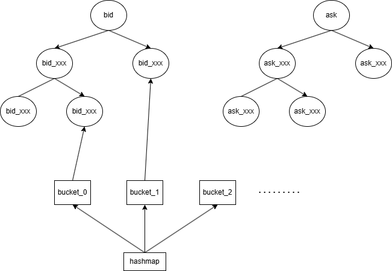

# 撮合流程简述

这里说的“撮合”主要是按逐笔委托、逐笔成交去重建盘口，然后用盘口去驱动快照和模拟单成交。

大致来讲的流程就是：
1. 收到委托挂入orderbook
2. 后续成交消去
3. 定期产出snapshot


为了实现快速的撮合，我参考了github上现有的orderbook设计 [HFT-Orderbook](https://github.com/Crypto-toolbox/HFT-Orderbook)
- 买卖盘双方都使用了一个平衡二叉树（有些地方的设计是红黑树，rust里面是B树）
- 用一个hashmap维护所有的订单，其中二叉树的叶子节点的value就是hashmap的key（OrderId）
- add新增订单操作本质上就是插入平衡二叉树，所以时间复杂度是O(logN)，其中N是总共的价格挡位
- cancel撤单操作实际上是删除掉hash表中的一项,并且更新价位，所以也是O(logN)
- getBestBid / getBestOffer (最优价位) 这个本质上就是求平衡二叉树的头尾，可以近似看作O(1)来处理




核心代码在 `src/matcher/order_book.rs`。

## 1. 总流程

1. `OrderBookWorker` 按标的串行消费 `ReplayEvent`，同一只股票固定落到同一个 worker。
2. `ReplayEvent::Order` 进 `OrderBook::apply_order()`。
3. `ReplayEvent::Transaction` 进 `OrderBook::apply_transaction()`。
4. `OrderBook` 更新内部状态：
   - `order_hash`：已经挂到盘口上的可见委托
   - `holding_orders`：深市市价单暂存区
   - `pending_cancels` / `pending_reductions`：处理先成交/先撤单，后看到委托的情况
5. 如果当前没有未结算的深市市价单，worker 才继续生成 snapshot，并驱动模拟交易。


## 2. 委托、撤单、成交

### 收到委托的时候

- `Limit`：限价单 --- 直接挂到盘口
- `BestOwn`：本方最优价 --- 先取本方最优价，再转成限价单
- `Market`：市价单（这个在后面会单独讲解） --- 深市不立刻挂盘，先放进 `holding_orders`
- `Cancel`：沪市撤单在委托流中，直接按单号扣减，深市撤单在成交流中


### 成交进入

- 沪市：成交只扣当前已经挂在盘口上的单
- 深市：成交既可能打到挂在盘口上面的单，也可能打到 `holding_orders` 里的市价单

核心逻辑如下：

```rust
match transaction.market {
    Market::XSHG => match transaction.deal_type.trim() {
        "B" | "S" | "N" => {
            self.record_trade_price(transaction.price);
            if transaction.buy_number > 0 {
                self.reduce_visible_order(transaction.buy_number, transaction.volume);
            }
            if transaction.sell_number > 0 {
                self.reduce_visible_order(transaction.sell_number, transaction.volume);
            }
        }
        _ => {
            return Err(OrderBookError::UnexpectedTransactionStreamCancel(Market::XSHG));
        }
    },
    Market::XSHE => match transaction.deal_type.trim() {
        "4" => self.cancel_transaction_orders(&transaction),
        "F" => {
            self.record_trade_price(transaction.price);
            self.process_shenzhen_trade(&transaction);
        }
        _ => {
            return Err(OrderBookError::UnexpectedTransactionStreamCancel(Market::XSHE));
        }
    },
    Market::Unknown => { /* 略 */ }
}
```

## 3. 深圳市价单

首先为什么我们要单独处理深圳市价单呢？

因为就我的理解来说，深圳的市价单应该是这样的流程（不一定完全准确，是通过撮合出来的结果推断的）

假设当前盘口只有一档：

  - 卖一：10.01，100 股

  现在来一笔深市买市价单：

  - 买市价，300 股


1. 先吃掉卖一 10.01的100股，此时市价单还剩200股没成交
2. 这200股应该按照规则挂到盘口上或者撤单


由于深圳的市价单，不是一个单一的概念，实际上是可以被区分成：
1. 市价转限价委托（对手方最优价）
2. 最优价格委托 （本方最优价,这个其实是有一个单独的类型 ```BestOwn```,似乎不被算作市价单）
3. 立即成交并撤销委托 
4. 最优五档立即成交并撤销委托
5. 全额成交或撤销委托

（具体细节可以参考[深圳证券交易所关于五种市价委托的业务说明](http://docs.static.szse.cn/www/marketServices/technicalservice/history/W020180328468088728908.doc)）

### 市价单来了先 hold，不直接挂盘

深市市价单进来以后，不会立刻进入 `bids` / `asks`，而是先进 `holding_orders`：

```rust
self.holding_orders.insert(
    order_id,
    HoldingOrder {
        remaining_volume: order.volume,
        order,
        resting_price: None,
        has_trade: false,
    },
);
```

也就是说，代码把它当成一笔“还没决定最终挂盘形态的单”。

### 成交来了怎么处理

这里分两步：

1. 先把这笔成交没有继续引用到的旧 holding 单收尾
2. 再处理当前成交真正打到的单

注意这里的第一步，有一个默认的前提：**市价单后面跟着的成交单（或者撤单）都是有关这个市价单的，如果后面的成交单开始不关联这个市价单了，那说明这个市价单的部分已经处理完了（或者说成交链断开了）**


```rust
fn process_shenzhen_trade(&mut self, transaction: &L2Transaction) {
    // 这笔成交引用了哪些订单号
    let referenced_ids = Self::referenced_order_ids(transaction);
    // holding_orders里面还有哪些市价单
    let holding_ids = self.holding_orders.keys().copied().collect::<Vec<_>>();
    // 查看哪些holding_order的id已经不在当前成交引用里面了
    let finalized_ids = holding_ids
        .into_iter()
        .filter(|order_id| !referenced_ids.contains(order_id))
        .collect::<Vec<_>>();
    // 处理掉这些已经结束成交链的订单
    let _ = self.finalize_holdings(&finalized_ids);

    if transaction.buy_number > 0 {
        self.reduce_order_with_trade_price(
            transaction.buy_number,
            transaction.volume,
            transaction.price,
        );
    }
    if transaction.sell_number > 0 {
        self.reduce_order_with_trade_price(
            transaction.sell_number,
            transaction.volume,
            transaction.price,
        );
    }
}
```

如果成交打的是 holding 市价单：

- 第一次打到它时，记下首次成交价
- 标记这笔市价单已经实际发生过成交
- 剩余量继续留在 holding 里等后续处理

```rust
if let Some(holding) = self.holding_orders.get_mut(&order_id) {
    let reduced_qty = holding.remaining_volume.min(matched_qty);
    if reduced_qty <= 0 {
        return 0;
    }

    if holding.resting_price.is_none() {
        holding.resting_price = Some(trade_price);
    }
    holding.has_trade = true;
    holding.remaining_volume -= reduced_qty;
    if holding.remaining_volume <= 0 {
        self.holding_orders.remove(&order_id);
    }
    return reduced_qty;
}
```

### 什么时候变成挂单

当一笔深市市价单的成交链结束后，如果还有剩余量，就转成限价挂单：

- 市价单先吃成交
- 如果没吃完，剩余量按首次成交价落成一笔限价单

```rust
let mut visible_order = holding.order;
visible_order.price = resting_price;
visible_order.volume = holding.remaining_volume;
visible_order.order_type = OrderType::Limit;
self.insert_visible_order(visible_order)?;
```

如果整条成交链下来一笔都没打到它，就直接丢掉，并记录在日志里（不过数据正常的情况下不会出现这种情况下）

## 4. 上海部分成交怎么处理

沪市这里没有单独的去处理部分成交，就是正常扣减可见单。

核心逻辑：

```rust
fn reduce_visible_order(&mut self, order_id: OrderId, qty: i64) -> Option<i64> {
    let (side, price, remaining_qty) = self.order_hash.get(&order_id).and_then(|order| {
        Some((
            Self::book_side_for_direction(order.direction).ok()?,
            order.price,
            order.volume,
        ))
    })?;
    let reduced_qty = remaining_qty.min(qty);
    if reduced_qty <= 0 {
        return Some(0);
    }

    let remove_order = if let Some(order) = self.order_hash.get_mut(&order_id) {
        order.volume -= reduced_qty;
        order.volume <= 0
    } else {
        false
    };
    if remove_order {
        self.order_hash.remove(&order_id);
        self.decrement_level_order_count(side, price);
    }

    // 扣减对应的挂单量
    self.adjust_level_total_qty(side, price, reduced_qty);
    self.remove_empty_level_if_drained(side, price);
    Some(reduced_qty)
}
```

所以沪市“部分成交”就是：

- 原单先挂在盘口
- 来一笔成交就减一笔
- 没减完就继续挂着
- 减完就删掉

没有额外分支。

## 5. 集合竞价

### 虚拟撮合价的计算

集合竞价的虚拟撮合价，是在当前买卖盘上枚举所有可能成交的价格，然后对每个价格分别计算“该价及以上的累计买量”和“该
  价及以下的累计卖量”，两者较小值就是这个价格下的可成交量。
  
  最终优先选择可成交量最大的价格；如果有多个价格并列，再
  选未成交量最小的；
  
  如果还并列，则优先取最接近最新成交价的那个价格，如果没有最新成交价，就取中间价。这个价格就是当
  前实现里的集合竞价虚拟撮合价。

  不过沪深交易所在细节上有一点不一致，目前我还没有实现的完全贴近交易所的虚拟成交价规则（主要是深市要用到前一天的收盘价来算，我这边不太方便拿到这个数据）[深交所交易规则](https://docs.static.szse.cn/www/lawrules/index/rule/W020230217564423808793.pdf) [上交所交易规则](https://www.sse.com.cn/lawandrules/sselawsrules2025/stocks/exchange/c/c_20250519_10779396.shtml)

为了实现尽量的统一，我这里实现 `call_auction_result()` 的逻辑是：

1. 枚举当前所有有效价位
2. 对每个候选价算：
   - 该价及以上累计买量
   - 该价及以下累计卖量
   - 理论可成交量 `min(bid_qty, ask_qty)`
3. 先选可成交量最大的
4. 由多个最大的并列时，选剩余量最小的
5. 如果还有多个并列时，优先靠近 `last_trade_price`；如果没有，就取中间价

核心代码：

```rust
fn call_auction_result(&self) -> Option<CallAuctionResult> {
    let mut best = Vec::new();
    for price in self.candidate_auction_prices() {
        // 统计当前价位及以上价位的累计买量
        let bid_qty = self.bid_qty_at_or_above(price);
        // 统计当前价位及以下价位的累计卖量
        let ask_qty = self.ask_qty_at_or_below(price);
        // 理论上可以成交的量
        let executable_qty = bid_qty.min(ask_qty);
        if executable_qty <= 0 {
            continue;
        }

        let result = CallAuctionResult {
            price,
            executable_qty,
            remaining_qty: bid_qty.abs_diff(ask_qty),
        };
        // 处理并列的情况
        match best.first() {
            None => best.push(result),
            Some(current) if result.is_better_primary_than(current) => {
                best.clear();
                best.push(result);
            }
            Some(current) if result.has_same_primary_score(current) => best.push(result),
            _ => {}
        }
    }

    if best.is_empty() {
        return None;
    }
    if best.len() == 1 {
        return best.into_iter().next();
    }

    if let Some(last_trade_price) = self.last_trade_price {
        best.into_iter()
            .min_by_key(|result| (result.price.abs_diff(last_trade_price), result.price))
    } else {
        best.sort_by_key(|result| result.price);
        // 中间价，实际上是取靠左的中位数
        best.get((best.len() - 1) / 2).copied()
    }
}
```

## 6. 总结

- 沪市：委托先挂进盘口，后面的成交再把对应订单一点点扣掉，所以部分成交就是“还没扣完，就继续留在盘口里”。

- 深市：普通限价单也是直接挂盘；市价单会先临时存起来，等后面的成交和撤单都走完以后，再决定这笔单是结束了、撤掉
    了，还是把剩余部分挂回盘口。现在的实现里，如果最后还有剩余，就按第一次成交的价格挂回去。

- 集合竞价：感觉还需改进，尝试和交易所的交易规则保持完全一致
